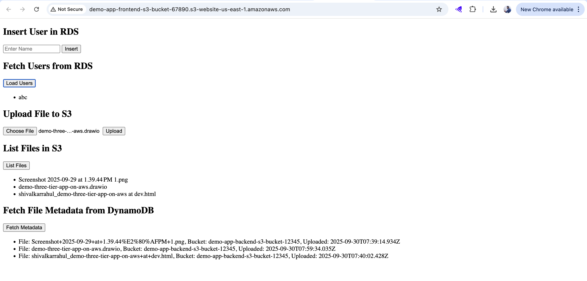
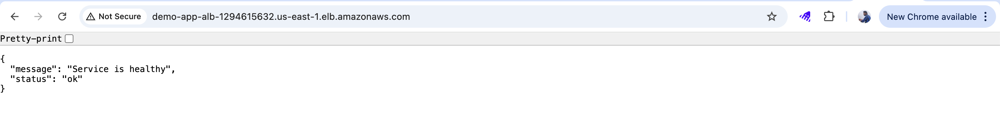
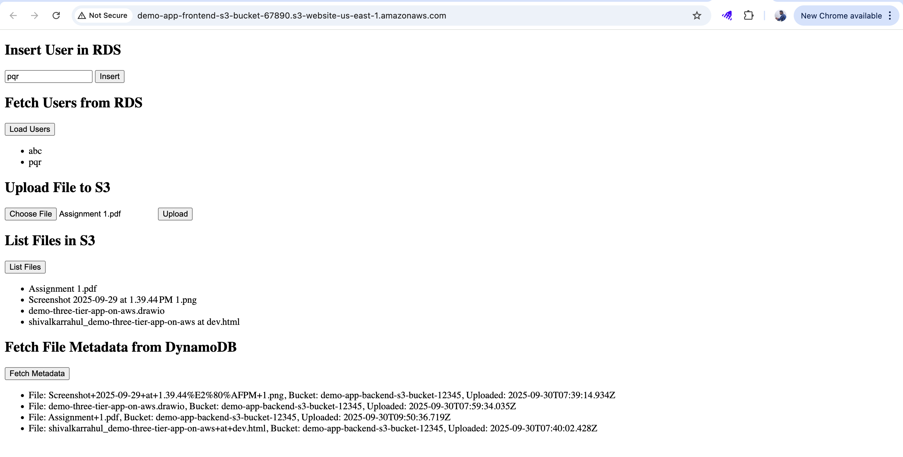
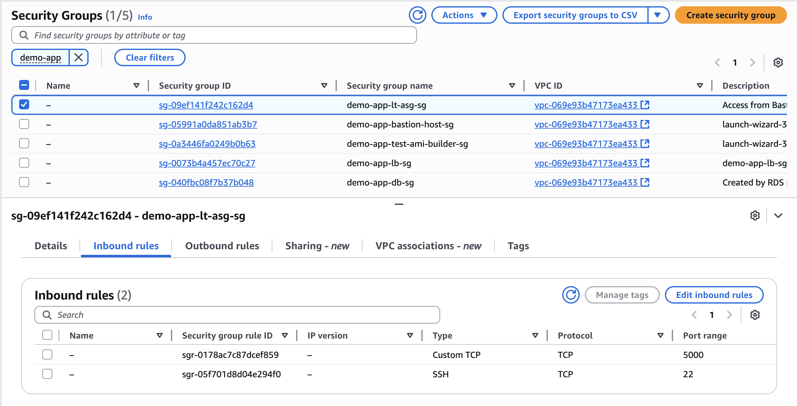
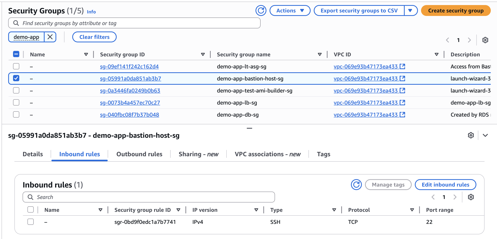
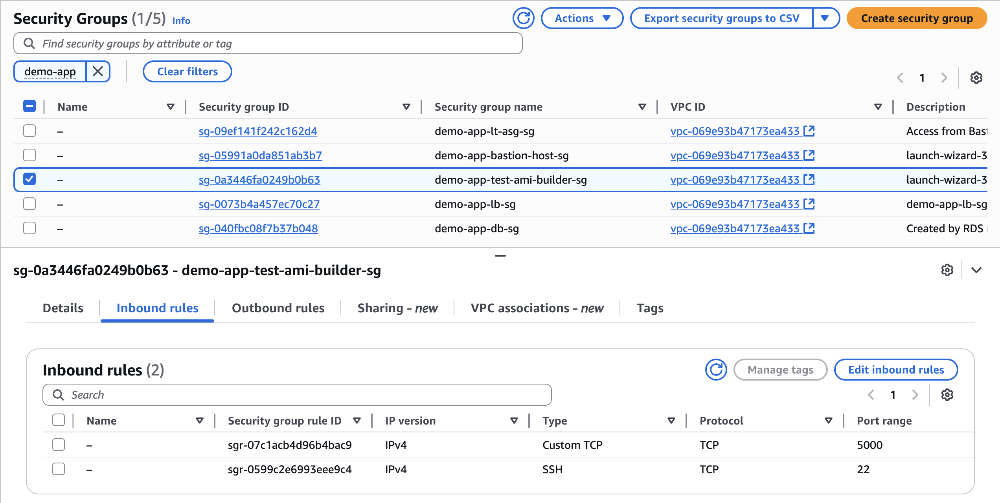
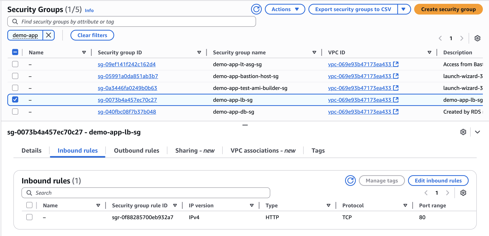
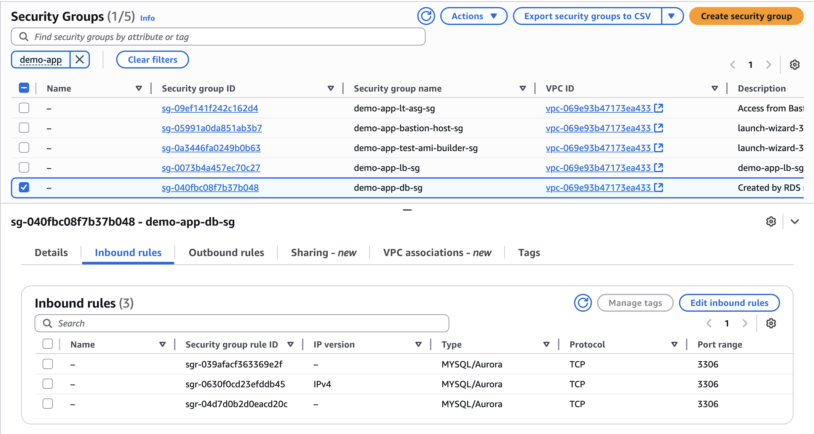

# From Hello World to Real World: A Hands-On Journey into Event-Driven Three-Tier Architecture on AWS

**Presenter:** Rahul Shivalkar

**Event:** AWS Cloud Club - MIT ADTU and AWS Cloud Club MIT-WPU

This intensive, hands-on workshop is designed for developers and cloud enthusiasts ready to move beyond basic setups and deploy a truly **scalable, secure, and production-ready three-tier application on AWS**.

**Workshop Flow:**

1. **Network Foundation:**

   * Build a robust custom VPC with Public and Private Subnets.
   * Configure NAT Gateways and a secure Bastion Host for management access.

2. **Backend Deployment & HA:**

   * Deploy a Flask backend application.
   * Ensure High Availability (HA) using an Application Load Balancer (ALB) distributing traffic across an Auto Scaling Group (ASG).

3. **Data Security & Event-Driven Integration:**

   * Secure the data layer by placing RDS (MySQL) in private subnets.
   * Implement an **event-driven pipeline**:

     * File uploads to S3 trigger SNS notifications.
     * AWS Lambda functions process metadata and store it in DynamoDB.

**Outcome:**
By the end of this workshop, attendees will have the practical skills and confidence to **design, deploy, and scale complex applications** using core AWS best practices in **networking, security, and serverless integration**.

---

<details>
<summary>Presentation</summary>

## Agenda

1. Introduction: Why event-driven, three-tier architectures matter
2. Three-Tier Architecture Overview
3. AWS Services & Event-Driven Design
4. Lambda & Serverless Integration
5. Storage & Data Flow
6. Application Layer: Flask on EC2
7. Monitoring & Notifications
8. Demo & Key Learnings

---

## Introduction

* Many applications start as simple scripts or “Hello World” apps.
* To be **production-ready**, they need to be scalable, decoupled, and event-driven.
* Event-driven design allows services to **react automatically to events**, reducing manual intervention.
* We focus on AWS services that make it easy to **build, monitor, and scale** applications efficiently.

---

## Three-Tier Architecture Overview

The **architecture is divided into three primary layers**:

1. **Presentation Layer (Frontend)**

   * Handles user interaction and requests.
   * Deployed via Application Load Balancer (ALB) routing traffic to the backend.

2. **Application Layer (Backend & Event-Driven Processing)**

   * Flask backend application deployed on EC2 Auto Scaling Group for High Availability (HA).
   * Event-driven integration components:

     * **S3**: for file uploads
     * **SNS**: for notifications
     * **Lambda**: for processing events and metadata
     * **DynamoDB**: stores processed metadata and supports serverless data operations

3. **Data Layer (Relational Database)**

   * **RDS (MySQL)** deployed in private subnets for secure and persistent storage.

**Note:** DynamoDB is used as part of the event-driven application workflow, complementing the main relational database but does not constitute a separate tier.

**Architecture Diagram:**


---

## Slide: AWS Services & Roles

| AWS Service                           | Role / Purpose in the Architecture                                                   |
| ------------------------------------- | ------------------------------------------------------------------------------------ |
| **VPC**                               | Provides an isolated network for the application. Hosts public and private subnets.  |
| **Public Subnets**                    | Hosts ALB and Bastion Host. Enables controlled access from the Internet.             |
| **Private Subnets**                   | Hosts EC2 backend instances, RDS database, and Lambda (via VPC endpoints if needed). |
| **NAT Gateway**                       | Allows private subnet instances to access the Internet securely (e.g., for updates). |
| **Bastion Host**                      | Secure access point to manage private EC2 instances.                                 |
| **EC2 (Auto Scaling Group)**          | Runs the Flask backend application with High Availability.                           |
| **Application Load Balancer (ALB)**   | Distributes incoming traffic across backend EC2 instances.                           |
| **RDS (MySQL)**                       | Primary relational database for application data, deployed in private subnets.       |
| **S3**                                | Stores uploaded files; triggers event-driven processing.                             |
| **SNS (Simple Notification Service)** | Sends notifications on S3 events to Lambda or other subscribers.                     |
| **Lambda**                            | Processes S3-triggered events, extracts metadata, and stores it in DynamoDB.         |
| **DynamoDB**                          | Stores processed metadata for serverless, scalable storage.                          |
| **Security Groups**                   | Controls inbound and outbound traffic for EC2, RDS, ALB, and Lambda.                 |
| **IAM Roles**                         | Provides permissions for Lambda, EC2, RDS, and other services to interact securely.  |
| **CloudWatch**                        | Monitors application, logs, and triggers alarms for metrics.                         |

**Summary:**
This setup ensures a **secure, scalable, and event-driven three-tier architecture**, combining **traditional relational data storage** with **serverless event processing**.

---

## Application Layer: Flask on EC2

* Flask backend runs on EC2, serving API endpoints.
* Handles CRUD operations on RDS (users, products, orders).
* Accepts file uploads to S3.
* Integrates with Lambda for event-driven processing.
* Ensures **security and isolation** via IAM roles.

**Key Advantage:** Combines **traditional server-based architecture** with serverless event-driven components.

---

## Event-Driven Design with Lambda

**Event Flow:**
`User → S3 → Lambda → DynamoDB → SNS → User`

**Steps:**

1. **Trigger Event:** File uploaded to S3 bucket.
2. **Processing:** Lambda function validates and processes the file.
3. **Database Update:** Updates DynamoDB metadata to track status.
4. **Notification:** Sends alerts to users/admins via SNS.

**Benefits:**

* Immediate response to events.
* Reduces load on EC2 backend.
* Improves reliability by decoupling components.

---

## Storage & Data Flow

* **S3 Bucket:** Stores uploaded files securely.
* **Lambda Function:** Acts as a processor and orchestrator.
* **DynamoDB Table:** Keeps metadata and event logs for tracking.
* **SNS Topic:** Sends real-time notifications to stakeholders.

**Outcome:** A **highly responsive, event-driven system** with minimal manual intervention.

---

## Monitoring & Notifications

* **CloudWatch Logs & Metrics:** Monitor EC2, Lambda, and RDS.
* **SNS Alerts:** Notifies developers or admins of failures or key events.

**Benefits:**

* Quick troubleshooting.
* Proactive system monitoring.
* Reduces downtime and manual checks.

---

## Demo Flow

1. **User uploads a file → S3 bucket**

   * The file is securely stored in S3 for processing.

2. **Lambda function triggers → processes the file**

   * Extracts metadata or transforms data as needed.

3. **RDS updates → relational data storage**

   * Stores structured relational data (e.g., new users via Flask APIs).

4. **DynamoDB updates → metadata and processing status**

   * Serverless storage for quick access to processing results and metadata.

5. **SNS sends notification → user/admin receives an email alert**

   * Alerts stakeholders that file processing is complete.

6. **Flask frontend shows updated data → reflects processed files**

   * Reads from RDS/DynamoDB to show real-time status to users.

---

## Key Takeaways

* Hybrid architecture using **EC2 + Lambda**.
* Event-driven design ensures **automatic, real-time processing**.
* Decoupled services allow **independent scaling** and reliability.
* Demonstrates a **production-ready system** suitable for enterprise applications.

<p align="left"><b>🔒 Presentation section ends here — continue with hands-on steps ⬇️</b></p>

</details>

---


## Hands-On Lab: Deploying the Three-Tier AWS Application

> **Context:** All the following steps are performed in the **us-east-1** (N. Virginia) region.

---

## Who This Guide Is For
This guide is intended for students and developers who want to **learn hands-on AWS deployment** using a three-tier architecture.  

---

## Prerequisites
- AWS Account with appropriate permissions  
- Basic Linux & SSH knowledge  
- Familiarity with Python and Flask

---

## Table of Contents
- [Part 1: Network Setup](#part-1-network-setup)
- [Part 2: Set Up RDS](#part-2-set-up-rds)
- [Part 3: Set Up S3](#part-3-set-up-s3)
- [Part 4: Configure SNS to Send Email Notifications on S3 File Uploads](#part-4-configure-sns-to-send-email-notifications-on-s3-file-uploads)
- [Part 5: Create DynamoDB Table and Lambda for File Metadata Extraction & Storage](#part-5-create-dynamodb-table-and-lambda-for-file-metadata-extraction--storage)
- [Part 6: Deploy a Flask Application on Test AMI Builder EC2 with RDS & S3, DynamoDB Integration in Public Subnet](#part-6-deploy-a-flask-application-on-test-ami-builder-ec2-with-rds--s3-dynamodb-integration-in-public-subnet)
- [Part 7: Create an AMI, Launch Template, and Auto Scaling Group](#part-7-create-an-ami-launch-template-and-auto-scaling-group)
- [Part 8: Attach Load Balancer to Auto Scaling Group (ASG)](#part-8-attach-load-balancer-to-auto-scaling-group-asg)
- [Part 9: Create a Bastion Host in Public Subnet to Access Instances in Private Subnet](#part-9-create-a-bastion-host-in-public-subnet-to-access-instances-in-private-subnet)
- [Part 10: Connect From Bastion Host to Private Instance](#part-10-connect-from-bastion-host-to-private-instance)
- [Part 11: Cleanup – Terminate All Resources](#part-11-cleanup--terminate-all-resources)

---

## Architecture Diagram - Three-Tier Architecture Overview


## Part 1: Network Setup (7 Mins)

<details>
<summary>📖 Theory: Understanding the Network Setup</summary>

In this section, we build the **foundation of the three-tier architecture** on AWS:

- **VPC:** Isolated network for your application.  
- **Subnets:** Public subnets for Load Balancers & NAT, private subnets for app and database layers.  
- **Internet Gateway & NAT Gateways:** Provide controlled internet access for resources.  
- **Route Tables:** Ensure secure and proper traffic routing between subnets and the internet.  

By completing this step, your AWS environment will be ready to securely host the application and database layers.

---

#### Detailed Explanation

**VPC (Virtual Private Cloud):**  
Think of the VPC as your own **virtual data center** inside AWS. It’s a completely isolated network where you define IP ranges, subnets, and routing. This ensures security and control over your infrastructure.

**Subnets:**  
Within the VPC, subnets logically partition the network.  
- **Public Subnets:** For resources that need internet access (Load Balancer, Bastion Host). Connected to the **Internet Gateway (IGW)**.  
- **Private Subnets:** For sensitive resources (application servers, databases). These subnets have **no direct internet access**, which reduces the attack surface.

**Internet Gateway (IGW) & NAT Gateway:**  
- The **IGW** connects public subnets to the internet.  
- The **NAT Gateway** allows private subnet resources to **initiate outbound traffic** (e.g., for updates) while blocking **inbound traffic** from the internet.

**Route Tables:**  
These act as **rules for traffic flow**:  
- Public Route Table → Routes traffic from public subnets to the IGW.  
- Private Route Table → Routes traffic from private subnets to the NAT Gateway.  

---

✅ **Why this matters:**  
This layered setup enforces **security, availability, and scalability**. Public resources stay accessible, private resources remain protected, and traffic flows are tightly controlled.

<p align="left"><b>🔒 Theory section ends here — continue with hands-on steps ⬇️</b></p>

</details>

---

### 1. Create a VPC
1. Go to **AWS Console → VPC Dashboard**.  
2. Click **Create VPC**. 
3. Select `VPC only`option under **Resources to create** 
4. Enter:  
   - **Name tag:** `demo-app-vpc`  
   - **IPv4 CIDR Block:** `10.0.0.0/16`
5. Keep all other settings as **default**.     
6. Click **Create VPC**.

**AWS CLI Command:**

```bash
aws ec2 create-vpc \
    --cidr-block 10.0.0.0/16 \
    --tag-specifications 'ResourceType=vpc,Tags=[{Key=Name,Value=demo-app-vpc}]' --no-cli-pager
```

```bash
VPC_ID=$(aws ec2 describe-vpcs --filters "Name=tag:Name,Values=demo-app-vpc" --query "Vpcs[0].VpcId" --output text)
echo $VPC_ID
```


### 2. Create Public & Private Subnets

#### 2.1 Public Subnets (For Load Balancer & NAT Gateways)
1. Go to **Subnets → Create Subnet**.  
2. Choose **VPC:** `demo-app-vpc`.  
3. Create three public subnets: (Use the **“Add subnet”** option to create **3 subnets at a time**:)  
   - `demo-app-public-subnet-1` → `10.0.1.0/24` → **us-east-1a**  
   - `demo-app-public-subnet-2` → `10.0.2.0/24` → **us-east-1b**  
   - `demo-app-public-subnet-3` → `10.0.3.0/24` → **us-east-1c**  
4. Click **Create**.

**AWS CLI Command:**

```bash
aws ec2 create-subnet --vpc-id $VPC_ID --cidr-block 10.0.1.0/24 --availability-zone us-east-1a \
    --tag-specifications 'ResourceType=subnet,Tags=[{Key=Name,Value=demo-app-public-subnet-1}]' --no-cli-pager
```

```bash
aws ec2 create-subnet --vpc-id $VPC_ID --cidr-block 10.0.2.0/24 --availability-zone us-east-1b \
    --tag-specifications 'ResourceType=subnet,Tags=[{Key=Name,Value=demo-app-public-subnet-2}]' --no-cli-pager
```

```bash
aws ec2 create-subnet --vpc-id $VPC_ID --cidr-block 10.0.3.0/24 --availability-zone us-east-1c \
    --tag-specifications 'ResourceType=subnet,Tags=[{Key=Name,Value=demo-app-public-subnet-3}]' --no-cli-pager
```

#### 2.2  Private Subnets (For App & DB Layers)
1. Go to **Subnets → Create Subnet**.  
2. Choose **VPC:** `demo-app-vpc`.  
3. Create three private subnets: (Use the **“Add subnet”** option to create **3 subnets at a time**:)  
   - `demo-app-private-subnet-1` → `10.0.11.0/24` → **us-east-1a**  
   - `demo-app-private-subnet-2` → `10.0.12.0/24` → **us-east-1b**  
   - `demo-app-private-subnet-3` → `10.0.13.0/24` → **us-east-1c**  
4. Click **Create**.

**AWS CLI Command:**

```bash
aws ec2 create-subnet --vpc-id $VPC_ID --cidr-block 10.0.11.0/24 --availability-zone us-east-1a \
    --tag-specifications 'ResourceType=subnet,Tags=[{Key=Name,Value=demo-app-private-subnet-1}]' --no-cli-pager
```

```bash
aws ec2 create-subnet --vpc-id $VPC_ID --cidr-block 10.0.12.0/24 --availability-zone us-east-1b \
    --tag-specifications 'ResourceType=subnet,Tags=[{Key=Name,Value=demo-app-private-subnet-2}]' --no-cli-pager
```

```bash
aws ec2 create-subnet --vpc-id $VPC_ID --cidr-block 10.0.13.0/24 --availability-zone us-east-1c \
    --tag-specifications 'ResourceType=subnet,Tags=[{Key=Name,Value=demo-app-private-subnet-3}]' --no-cli-pager
```

### 3. Create & Attach Internet Gateway (IGW)
1. Go to **Internet Gateways → Create Internet Gateway**.  
2. Enter:  
   - **Name:** `demo-app-igw`  
3. Click **Create**.  
4. Select `demo-app-igw` → Click **Actions → Attach to VPC**.  
5. Choose **VPC:** `demo-app-vpc` → Click **Attach**.

**AWS CLI Commands:**

```bash
IGW_ID=$(aws ec2 create-internet-gateway \
    --tag-specifications 'ResourceType=internet-gateway,Tags=[{Key=Name,Value=demo-app-igw}]' \
    --query 'InternetGateway.InternetGatewayId' --output text)
echo $IGW_ID
```

```bash
aws ec2 attach-internet-gateway --internet-gateway-id $IGW_ID --vpc-id $VPC_ID --no-cli-pager
```

### 4. Create & Configure Route Tables

#### 4.1 Public Route Table (For Public Subnets)
1. Go to **Route Tables → Create Route Table**.  
2. Enter:  
   - **Name:** `demo-app-public-rt`  
   - **VPC:** `demo-app-vpc`  
3. Click **Create**.  
4. Select `demo-app-public-rt` → **Routes → Edit Routes**.  
5. Add Route:  
   - **Destination:** `0.0.0.0/0`  
   - **Target:** Internet Gateway → `demo-app-igw`  
6. Click **Save Routes**.  
7. Go to **Subnet Associations → Edit Subnet Associations**.  
8. Select:  
   - ✅ `demo-app-public-subnet-1`  
   - ✅ `demo-app-public-subnet-2`  
   - ✅ `demo-app-public-subnet-3`  
9. Click **Save Associations**.

**AWS CLI Commands:**

```bash
# Get IDs
VPC_ID=$(aws ec2 describe-vpcs --filters "Name=tag:Name,Values=demo-app-vpc" --query "Vpcs[0].VpcId" --output text)
echo $VPC_ID

IGW_ID=$(aws ec2 describe-internet-gateways --filters "Name=tag:Name,Values=demo-app-igw" --query "InternetGateways[0].InternetGatewayId" --output text)
echo $IGW_ID

SUBNET_IDS=$(aws ec2 describe-subnets --filters "Name=tag:Name,Values=demo-app-public-subnet-1,demo-app-public-subnet-2,demo-app-public-subnet-3" --query "Subnets[].SubnetId" --output text)
echo $SUBNET_IDS

```


```bash
# Create public route table
PUBLIC_RT_ID=$(aws ec2 create-route-table --vpc-id $VPC_ID --tag-specifications 'ResourceType=route-table,Tags=[{Key=Name,Value=demo-app-public-rt}]' --query 'RouteTable.RouteTableId' --output text)
echo $PUBLIC_RT_ID
```

```bash
# Create route to IGW
aws ec2 create-route --route-table-id $PUBLIC_RT_ID --destination-cidr-block 0.0.0.0/0 --gateway-id $IGW_ID --no-cli-pager
```

```bash
# Associate subnets
for SUBNET_ID in $SUBNET_IDS; do
    aws ec2 associate-route-table --route-table-id $PUBLIC_RT_ID --subnet-id $SUBNET_ID --no-cli-pager
done
```

### 5. Create NAT Gateways

In this step, we will create NAT Gateways to allow instances in private subnets to access the internet for updates and downloads.

<details>
<summary>✅ Demo Setup (1 NAT Gateway)</summary>

This setup uses **a single NAT Gateway** for all private subnets to save costs.

#### 5.1 Allocate Elastic IP

1. Go to **Elastic IPs** in AWS Console.
2. Click **Allocate Elastic IP → Allocate** (allocate **1 Elastic IP**).
3. Click **Tags → Add new tag**:  
   - **Key:** `Name`
   - **Value:** `demo-app-eip-1`

**AWS CLI Commands:**

```bash
EIP_ALLOC_ID=$(aws ec2 allocate-address --domain vpc --tag-specifications 'ResourceType=elastic-ip,Tags=[{Key=Name,Value=demo-app-eip-1}]' --query 'AllocationId' --output text)
echo $EIP_ALLOC_ID
```

#### 5.2 Create NAT Gateway

1. Go to **NAT Gateways → Create NAT Gateway**.
2. Enter:

   * **Name:** `demo-app-nat-gateway-1`
   * **Subnet:** `demo-app-public-subnet-1`
   * **Elastic IP:** Select the `demo-app-eip-1` Elastic IP you allocated
3. Click **Create NAT Gateway**.
4. Wait until the status shows **Available**.

✅ This NAT Gateway will be used for all private subnets.

```bash
PUBLIC_SUBNET_ID=$(aws ec2 describe-subnets --filters "Name=tag:Name,Values=demo-app-public-subnet-1" --query "Subnets[0].SubnetId" --output text)
echo $PUBLIC_SUBNET_ID
```

```bash
NAT_ID=$(aws ec2 create-nat-gateway --subnet-id $PUBLIC_SUBNET_ID --allocation-id $EIP_ALLOC_ID --tag-specifications 'ResourceType=natgateway,Tags=[{Key=Name,Value=demo-app-nat-gateway-1}]' --query 'NatGateway.NatGatewayId' --output text)
echo $NAT_ID
```

```bash
# Wait until NAT is available
aws ec2 wait nat-gateway-available --nat-gateway-ids $NAT_ID --no-cli-pager
```

</details>

<details>
<summary>✅ Prod Setup (3 NAT Gateways)[DO NOT FOLLOW THIS]</summary>

This setup uses **one NAT Gateway per public subnet** for high availability and fault tolerance.

#### 5.1 Allocate Elastic IPs

1. Go to **Elastic IPs** in AWS Console.
2. Click **Allocate Elastic IP → Allocate** **3 times** (one for each NAT Gateway).
3. For each Elastic IP, click **Tags → Add new tag**:  
   - **Key:** `Name`  
   - **Value:** `demo-app-eip-1`, `demo-app-eip-2`, and `demo-app-eip-3` respectively


#### 5.2 Create NAT Gateways

**NAT Gateway 1**

* Name: `demo-app-nat-gateway-1`
* Subnet: `demo-app-public-subnet-1`
* Elastic IP: `demo-app-eip-1` first Elastic IP
* Click **Create**, wait until **Available**

**NAT Gateway 2**

* Name: `demo-app-nat-gateway-2`
* Subnet: `demo-app-public-subnet-2`
* Elastic IP: `demo-app-eip-2` second Elastic IP
* Click **Create**, wait until **Available**

**NAT Gateway 3**

* Name: `demo-app-nat-gateway-3`
* Subnet: `demo-app-public-subnet-3`
* Elastic IP: `demo-app-eip-3` third Elastic IP
* Click **Create**, wait until **Available**

✅ Each NAT Gateway will be associated with its respective private subnet.

</details>

✅ **Note:** Proceed to the next step (creating private route tables) only after all NAT Gateways show **Available**.

### 6. Create Route Tables for Private Subnets

In this step, we will create route tables to direct traffic from private subnets to the internet via NAT Gateways.

<details>
<summary>✅ Demo Setup (1 Route Table)</summary>

This setup uses **one NAT Gateway** for all private subnets → only **one route table** is needed.

#### 6.1 Create Route Table

1. Go to **Route Tables → Create Route Table**.
2. Enter:

   * **Name:** `demo-app-private-rt-1`
   * **VPC:** `demo-app-vpc`
3. Click **Create**.

#### 6.2 Edit Routes

1. Select `demo-app-private-rt-1` → **Edit Routes**.
2. Add Route:

   * **Destination:** `0.0.0.0/0`
   * **Target:** NAT → `demo-app-nat-gateway-1`
3. Click **Save Routes**.

#### 6.3 Associate Subnets

1. Go to **Subnet Associations → Edit Subnet Associations**.
2. Select:

   * ✅ `demo-app-private-subnet-1`
   * ✅ `demo-app-private-subnet-2`
   * ✅ `demo-app-private-subnet-3`
3. Click **Save Associations**.

✅ All private subnets now use the same NAT Gateway via this route table.

```bash
# Create private route table
PRIVATE_RT_ID=$(aws ec2 create-route-table --vpc-id $VPC_ID --tag-specifications 'ResourceType=route-table,Tags=[{Key=Name,Value=demo-app-private-rt-1}]' --query 'RouteTable.RouteTableId' --output text)
echo $PRIVATE_RT_ID
```

```bash
# Create route to NAT Gateway
aws ec2 create-route --route-table-id $PRIVATE_RT_ID --destination-cidr-block 0.0.0.0/0 --nat-gateway-id $NAT_ID --no-cli-pager
```

```bash
# Associate private subnets
PRIVATE_SUBNET_IDS=$(aws ec2 describe-subnets --filters "Name=tag:Name,Values=demo-app-private-subnet-1,demo-app-private-subnet-2,demo-app-private-subnet-3" --query "Subnets[].SubnetId" --output text)
echo $PRIVATE_SUBNET_IDS
```

```bash
for SUBNET_ID in $PRIVATE_SUBNET_IDS; do
    aws ec2 associate-route-table --route-table-id $PRIVATE_RT_ID --subnet-id $SUBNET_ID --no-cli-pager
done
```

</details>

<details>
<summary>✅ Prod Setup (3 Route Tables) [DO NOT FOLLOW THIS]</summary>

This setup uses **one NAT Gateway per private subnet**, requiring **three route tables** for high availability.

#### 6.1 Route Table for Private Subnet 1

1. Go to **Route Tables → Create Route Table**.
2. Enter:

   * **Name:** `demo-app-private-rt-1`
   * **VPC:** `demo-app-vpc`
3. Click **Create**.
4. Edit Routes → Add Route:

   * Destination: `0.0.0.0/0`
   * Target: NAT → `demo-app-nat-gateway-1`
5. Associate **private-subnet-1**.

#### 6.2 Route Table for Private Subnet 2

1. Go to **Route Tables → Create Route Table**.
2. Enter:

   * Name: `demo-app-private-rt-2`
   * VPC: `demo-app-vpc`
3. Click **Create**.
4. Edit Routes → Add Route:

   * Destination: `0.0.0.0/0`
   * Target: NAT → `demo-app-nat-gateway-2`
5. Associate **private-subnet-2**.

#### 6.3 Route Table for Private Subnet 3

1. Go to **Route Tables → Create Route Table**.
2. Enter:

   * Name: `demo-app-private-rt-3`
   * VPC: `demo-app-vpc`
3. Click **Create**.
4. Edit Routes → Add Route:

   * Destination: `0.0.0.0/0`
   * Target: NAT → `demo-app-nat-gateway-3`
5. Associate **private-subnet-3**.

✅ Each private subnet now has its **own NAT Gateway via separate route tables**.

</details>

✅ **Note:**

* **Demo readers:** use only `demo-app-private-rt-1` for all private subnets.
* **Prod readers:** use three route tables, one per private subnet.
* After this step, your **VPC, subnets, Internet Gateway, NAT Gateways, and route tables** are fully configured — forming the foundation of your three-tier architecture.

---

## Part 2: Set Up RDS (3 Mins)

<details>
<summary>📖 Theory: The Data Layer</summary>

In this step, we create a **MySQL RDS instance** to store the application’s data.  

- The database will hold **user information** (e.g., names, IDs, orders, etc.).  
- The RDS instance is placed in **private subnets** for security, ensuring only the **application layer** can access it.  
- After this step, the database is ready to support the backend of your three-tier application.  

---

#### Detailed Explanation

**Database in Multi-Tier Architecture:**  
The database is the **core of any application**. Separating it into a dedicated data layer ensures **security, maintainability, and scalability**.  

**Amazon RDS (Relational Database Service):**  
AWS RDS is a **fully managed service** that handles:  
- Automatic backups  
- Patching and updates  
- Failover and replication  
- Scaling (vertical and horizontal)  

This removes the burden of infrastructure management, letting you focus on your **application data and logic**.  

**Why Private Subnets?**  
- The RDS instance is placed in **private subnets**, meaning it **cannot be accessed directly** from the internet.  
- Only **application servers** in the private subnets can connect to it.  
- This is a **critical security measure** that prevents unauthorized access.  

**Database Subnet Group:**  
When creating RDS, you must specify a **DB Subnet Group**. This ensures AWS deploys the database across your chosen **private subnets** for high availability and isolation.  

---

✅ **Why this matters:**  
Placing the database in private subnets enforces **security best practices** while RDS ensures **operational efficiency**. Together, they form a **secure and reliable data layer** for your application.

<p align="left"><b>🔒 Theory section ends here — continue with hands-on steps ⬇️</b></p>

</details>

---

### 1. Create an RDS Instance
1. Open **AWS Management Console → RDS**.  
2. Click **Create database**.  
3. Choose **Standard create**.  
4. Select **MySQL** as the database engine.  
5. Select **Engine version** as `MySQL 8.0.42`
5. Select **Free tier** to avoid charges.

### 2. Configure Database Settings
1. Set **DB instance identifier:** `my-demo-db`  
2. Set **Master username:** `admin`
3. Select **Credentials management** as **Self managed**  
3. Set **Master password:** Choose a strong password and **note it down** somewhere safe.

### 3. Configure Storage
1. **Storage type:** General Purpose (SSD)  
2. **Allocated storage:** 20 GiB  
3. Keep **storage auto-scaling enabled** under Additional storage configuration.

### 4. Configure Connectivity
1. **VPC:** Select the VPC created earlier (`demo-app-vpc`).  
2. **Subnet group:** Select **Create new DB subnet group**.  
3. **Public access:** Select **No** (RDS should **not** be publicly accessible).  
4. **VPC security groups:**  
   - Click **Create new security group**  
   - Name: `demo-app-db-sg`

### 5. Create the RDS Instance
1. Click **Create database**.  
2. Wait for the RDS instance to reach **Available** status before proceeding.  

✅ **At this point, your MySQL RDS instance is ready and securely placed in your private subnets.**

---


## Part 3: Set Up S3 (1 Min)

<details>
<summary>📖 Theory: The Storage Layer</summary>

In this step, we create an **Amazon S3 bucket** to store files uploaded by users.  

- The bucket will hold **images, documents, or any backend files** required by the application.  
- **Proper permissions and versioning** ensure security and easy recovery of files.  
- After this step, the S3 bucket is ready to support backend file storage.  
- Files uploaded to the `demo-app` will be stored here.  

---

#### Detailed Explanation

**Why a Separate Storage Layer?**  
In a **cloud-native architecture**, it’s best practice to separate **file storage** from your application’s **compute layer**.  
This ensures files are not tied to a single server and remain available even if servers are replaced, restarted, or scaled.  

**Amazon S3 (Simple Storage Service):**  
- Provides **object storage** that is **scalable, durable, and highly available**.  
- Allows storing and retrieving **any amount of data** at any time.  
- Removes the need to manage physical disks or worry about capacity planning.  

**Key Features for Security & Reliability:**  
- **Bucket Versioning:** Keeps multiple versions of a file → easy recovery from **accidental deletions or overwrites**.  
- **Block Public Access:** Prevents files from being exposed to the internet by default → critical for protecting **sensitive data**.  
- **IAM Policies & Permissions:** Ensure only authorized services (e.g., your app servers) can access the bucket.  

---

✅ **Why this matters:**  
By using S3 for file storage, you gain a **cost-effective, secure, and highly durable storage solution** that integrates seamlessly with the rest of your AWS architecture.

<p align="left"><b>🔒 Theory section ends here — continue with hands-on steps ⬇️</b></p>

</details>

---

### 1. Create an S3 Bucket
1. Open **AWS Console → Navigate to S3**.
2. Click **Create bucket**.
3. Enter a unique bucket name, for example:  
   `demo-app-backend-s3-bucket-1234`  
   
   🚨 **Important:**  
   - S3 bucket names must be globally unique across all AWS accounts.  
   - You may use a different name if this one is not available.  
   - **Note:** Keep a record of this bucket name as it will be required later.  
   - It is recommended to add a random string at the end of the bucket name `demo-app-backend-s3-bucket-1234-<some-random-string>` to avoid conflicts or confusion.

4. Choose the **same region** as your VPC (e.g., `us-east-1`).
5. Keep **Block Public Access enabled** (recommended for security).
6. Disable **Bucket Versioning** (optional – useful to keep previous versions of uploaded files.)
7. Leave other settings as default and click **Create bucket**.
8. Click **Create bucket**.  


✅ Your S3 bucket is now ready to store backend files for the demo application.

---

## Part 4: Configure SNS to Send Email Notifications on S3 File Uploads (4 mins)

<details>
<summary>📖 Theory: Decoupled Messaging and Events</summary>

In this step, we use **Amazon SNS (Simple Notification Service)** to get email alerts whenever a file is uploaded to **S3**.  

- An **SNS topic** is created and linked to the S3 bucket.  
- Users can **subscribe via email** to receive real-time notifications.  
- This ensures the team is immediately aware of **new uploads** for processing or auditing.  

---

#### Detailed Explanation

**Why Decoupling Matters?**  
A key principle of building **scalable architectures** is to **decouple services**.  
Instead of one service directly calling another, we use **event-driven messaging**. This improves flexibility, reliability, and scalability.  

**Amazon SNS (Simple Notification Service):**  
- A **fully managed pub/sub (publish/subscribe)** messaging service.  
- **Publisher:** A service that generates events (here, the S3 bucket).  
- **Subscribers:** Services or endpoints that receive the event (here, an email endpoint, and later possibly Lambda).  

**How it works in our setup:**  
1. A file is uploaded to the **S3 bucket** (event trigger).  
2. S3 publishes a **notification** to the SNS topic.  
3. SNS **broadcasts the message** to all its subscribers.  
   - Example: Email notification to the team.  
   - Example (future): A Lambda function to process the file.  

**Benefits of SNS Integration:**  
- **Loose Coupling:** Services don’t depend directly on each other.  
- **Scalability:** Easily add new subscribers (e.g., another app, SMS, or Lambda) without modifying S3.  
- **Flexibility:** Supports multiple use cases like file processing, auditing, or triggering workflows.  

---

✅ **Why this matters:**  
By introducing SNS, we’re moving towards an **event-driven, decoupled architecture** that makes our system more **resilient, extensible, and scalable** for future enhancements.

<p align="left"><b>🔒 Theory section ends here — continue with hands-on steps ⬇️</b></p>

</details>

---

### 1. Create an SNS Topic
1. Go to AWS Console → Amazon SNS.
2. Click **Topics → Create topic**.
3. Select **Type:** Standard.
4. Enter **Name:** `demo-app-sns-topic`.
5. Click **Create topic**.

### 2. Subscribe an Email to the SNS Topic
1. In SNS Console → Topics, select `demo-app-sns-topic`.
2. Click **Create subscription**.
3. Protocol: **Email**.
4. Endpoint: Enter your email address (e.g., `your-email@example.com`).
5. Click **Create subscription**.
6. Open your email and confirm the subscription (click the link from AWS SNS).

> **Note:** You should see the status as **Confirmed** for your subscription


### 3. Update SNS Topic Policy to Allow S3 to Publish
1. In SNS Console, click `demo-app-sns-topic`.
2. Click **Edit → Access policy**.
3. Replace the existing policy with:

> **Note:** In the following policy, replace `YOUR_AWS_ACCOUNT_ID` with your AWS Account ID.

```json
{
  "Version": "2012-10-17",
  "Id": "__default_policy_ID",
  "Statement": [
    {
      "Sid": "AllowS3ToPublish",
      "Effect": "Allow",
      "Principal": {
        "Service": "s3.amazonaws.com"
      },
      "Action": "SNS:Publish",
      "Resource": "arn:aws:sns:us-east-1:YOUR_AWS_ACCOUNT_ID:demo-app-sns-topic",
      "Condition": {
        "StringEquals": {
          "aws:SourceAccount": "YOUR_AWS_ACCOUNT_ID"
        }
      }
    }
  ]
}
```

4. Click **Save changes**.

### 4. Configure S3 to Trigger SNS on File Upload

1. Open **AWS Console → S3** and select your bucket (e.g., `demo-app-backend-s3-bucket-1234`).
2. Go to **Properties → Event notifications**.
3. Click **Create event notification**.
4. Enter **Event name:** `demo-app-s3-object-upload-notification`.
5. Select **Event types:** `All object create events`.
6. Set **Destination:** **SNS topic**, select `demo-app-sns-topic`.
7. Click **Save changes**.

✅ Now, whenever a file is uploaded to this bucket, an email notification will be sent via SNS.

---

## Part 5: Create DynamoDB Table and Lambda for File Metadata Extraction & Storage (5 Mins)

<details>
<summary>📖 Theory: Serverless Data Processing and Storage</summary>

In this step, we **store metadata of uploaded files in DynamoDB using a Lambda function**:  

- A **DynamoDB table** is created to save details like `file_name`, `bucket_name`, and `upload_timestamp`.  
- **Lambda** is triggered by the **SNS notification** from S3 uploads.  
- This automates **tracking and management** of uploaded files, enabling easy retrieval and further processing.  

---

#### Detailed Explanation

**AWS Lambda (Serverless Compute):**  
- A **serverless, event-driven compute service**.  
- No servers to provision or manage.  
- Runs your code automatically in response to events.  
- In our case, the event is an **SNS message** triggered when a file is uploaded to S3.  
- Lambda acts as the **glue** between the storage (S3) and data (DynamoDB) layers.  

**Amazon DynamoDB (NoSQL Database):**  
- A **fully managed NoSQL database** designed for **key-value** and **document** data.  
- Extremely **fast, scalable, and schema-less** (no fixed schema required).  
- Perfect for storing **lightweight, structured metadata** such as:  
  - `file_name`  
  - `bucket_name`  
  - `upload_timestamp`  

**Workflow in Our Setup:**  
1. A file is uploaded to **S3**.  
2. S3 triggers an **SNS notification**.  
3. The **SNS topic** invokes the **Lambda function**.  
4. Lambda extracts **file metadata** and stores it in **DynamoDB**.  

**Benefits of This Design:**  
- **Fully automated:** No manual intervention needed for tracking uploads.  
- **Serverless:** Scales automatically, no server management required.  
- **Event-driven:** Each upload triggers the workflow instantly.  
- **Seamless integration:** Storage, processing, and data management work together.  

---

✅ **Why this matters:**  
This pipeline (S3 → SNS → Lambda → DynamoDB) is a **classic serverless, event-driven architecture**. It’s **scalable, cost-efficient, and maintenance-free**, making it ideal for modern cloud-native applications.

<p align="left"><b>🔒 Theory section ends here — continue with hands-on steps ⬇️</b></p>

</details>

---

### 1. Create a DynamoDB Table
1. Go to AWS Console → DynamoDB → Tables → **Create Table**.
2. Enter **Table name:** `demo-app-file-metadata-dynamodb`.
3. Set **Partition Key:**  
   - Name: `file_name`  
   - Type: String
4. Leave all other settings as default.
5. Click **Create Table**.

> **Important:** You don’t need to manually define other required attributes like `upload_time` or `file_size`. These will be dynamically inserted by the Lambda function. You can view them under **Explore Items** in DynamoDB later.

### 2. Create an IAM Role for Lambda
1. Go to **IAM Console → Roles → Create role**.
2. Select **AWS Service → Lambda → Next**.
3. Search and attach the following policies:
   - `AmazonS3ReadOnlyAccess` (To read files from S3)  
   - `AmazonDynamoDBFullAccess` (To write metadata to DynamoDB)  
   - `AWSLambdaBasicExecutionRole` (For CloudWatch logging)
4. Click on Next.
5. Name the role: `demo-app-lambda-iam-role`.
6. Create the role and note the **Role ARN**.


### 3. Create a Lambda Function
1. Go to **Lambda Console → Create function**.
2. Choose **Author from scratch**.
3. Enter **Function Name:** `demo-app-metadata-lambda`.
4. Select **Python 3.13** as Runtime.
5. Choose **Use an existing role** and select the IAM role created earlier (`demo-app-lambda-iam-role`) under **Change default execution role**.
6. Click **Create Function**.

### 4. Subscribe Lambda to Existing SNS Topic
1. Go to **SNS Console → Your SNS Topic (`demo-app-sns-topic`)**.
2. Click **Create Subscription**.
3. Protocol: **AWS Lambda**.
4. Select the Lambda Function you created (`demo-app-metadata-lambda`).
5. Click **Create Subscription**.
6. Return to the SNS Topic `demo-app-sns-topic` and verify that there are now **2 subscriptions**, both showing the **Status: Subscribed**.


### 5. Update Lambda Code to Process SNS Events
1. Go to **Lambda → `demo-app-metadata-lambda` → Code**.
2. Paste the following Python code:

```python
import boto3
import json

# Set the AWS Region
AWS_REGION = "us-east-1"

# Initialize DynamoDB
dynamodb = boto3.resource('dynamodb', region_name=AWS_REGION)
TABLE_NAME = "demo-app-file-metadata-dynamodb"

def lambda_handler(event, context):
    try:
        print("✅ Event received:", json.dumps(event, indent=2))
        for record in event.get("Records", []):
            sns_message = record["Sns"]["Message"]
            print("✅ Extracted SNS Message:", sns_message)
            s3_event = json.loads(sns_message)

            for s3_record in s3_event.get("Records", []):
                s3_info = s3_record.get("s3", {})
                bucket_name = s3_info.get("bucket", {}).get("name")
                file_name = s3_info.get("object", {}).get("key")

                if not bucket_name or not file_name:
                    print("❌ Missing bucket name or file name, skipping record.")
                    continue 

                print(f"✅ Extracted File: {file_name} from Bucket: {bucket_name}")

                table = dynamodb.Table(TABLE_NAME)
                table.put_item(
                    Item={
                        "file_name": file_name,
                        "bucket_name": bucket_name,
                        "timestamp": s3_record["eventTime"]
                    }
                )

        return {"statusCode": 200, "body": "File metadata stored successfully"}

    except Exception as e:
        print("❌ Error:", str(e))
        return {"statusCode": 500, "body": f"Error: {str(e)}"}
```

3. Click **Deploy**.

### 6. Quick Test

After setting up S3, SNS, DynamoDB, and Lambda:

1. Upload a file to your S3 bucket (e.g., `demo-app-backend-s3-bucket-1234`).
2. You should receive an email notification from SNS.
3. Go to **Lambda → demo-app-metadata-lambda → Monitor → View CloudWatch Logs**.
4. Open the latest log stream.
   - You should see a log entry like:  
     `Extracted File: <your file name> from Bucket: <your bucket name>`
5. Go to **DynamoDB → Explore Items**, select the table `demo-app-file-metadata-dynamodb`, and click **Run**.
   - You should see **one entry** corresponding to the file you just uploaded.

✅ This confirms that uploading a file to S3 triggers SNS, which sends an email, invokes Lambda, and writes metadata to DynamoDB successfully.

---

## Part 6: Deploy a Flask Application on Test AMI Builder EC2 with RDS & S3, DynamoDB Integration in Public Subnet
(20 Mins)
<details>
<summary>📖 Theory: The Application Layer and Service Integration</summary>

In this step, we **deploy the backend Flask application** on a test **EC2 instance** with full integration to **RDS, S3, and DynamoDB**.  

---

#### Detailed Explanation

**Application Layer (Business Logic):**  
- This is the **core of the three-tier architecture** where your **business logic** resides.  
- We use **Amazon EC2 (Elastic Compute Cloud)** as the application server.  
- Think of EC2 as a **virtual machine in the cloud**, giving you full control over OS, software, and environment.  
- The EC2 instance is launched in a **public subnet** so it’s easily accessible for testing.  

**IAM Role for Secure Access:**  
- Instead of storing AWS keys inside your code, we attach an **IAM Role** to the EC2 instance.  
- The IAM Role grants the Flask app the necessary permissions to:  
  - Read/write files in **S3**.  
  - Insert/retrieve metadata from **DynamoDB**.  
- This is a **best practice for security**, since no credentials are hardcoded in the app.  

**Flask Application (Integration Hub):**  
- Acts as the **communication hub** between the frontend and backend services.  
- Handles requests and routes them to the correct services.  
- Uses:  
  - **pymysql** → To connect to **RDS MySQL** (data layer) for CRUD operations.  
  - **boto3** → To interact with:  
    - **S3** for file uploads/downloads.  
    - **DynamoDB** for retrieving file metadata.  

**Service Management (systemd):**  
- We configure the Flask app as a **systemd service**.  
- This ensures:  
  - The app **starts automatically** on EC2 reboot.  
  - The app stays **running reliably** in the background.  

---

✅ **Why this matters:**  
The **application layer** is the glue that ties everything together — frontend, database, file storage, and metadata. By combining **EC2, IAM roles, Flask, and AWS SDKs**, we build a secure, modular, and production-ready backend for the three-tier architecture.  

<p align="left"><b>🔒 Theory section ends here — continue with hands-on steps ⬇️</b></p>

</details>

---

### 1. Create an IAM Role for S3 and DynamoDB Access
1. Open AWS IAM Console → **Roles → Create Role**.
2. Select **AWS Service → EC2 → Next**.
3. Search and attach the following policies:  
   - `AmazonS3FullAccess`  
   - `AmazonDynamoDBReadOnlyAccess`
4. Click on Next.   
5. Name the role: `demo-app-s3-dynamo-iam-role`
6. Click **Create**.

### 2. Launch a Test and AMI Builder EC2 Instance
1. Open AWS EC2 Console → **Launch Instance**.
2. Enter **Instance Name:** `demo-app-test-ami-builder`.
3. Choose AMI: Ubuntu Server 24.04 LTS (HVM), SSD Volume Type .
4. Instance Type: `t2.micro` (free-tier) or as required.
5. Key Pair: Create or select an existing key pair (download `.pem` for terminal(Linux/Mac), `.ppk` for Putty(Windows)).  
   Name: `demo-app-private-key`.
6. Network → Edit : Select your `demo-app-vpc` VPC → Subnet: `demo-app-public-subnet-1`.
7. Enable `Auto-assign Public IP`.
8. Security Group: Create or select:  
   - Name: `demo-app-test-ami-builder-sg`  
   - Allow SSH (22) from Anywhere (Not recommended in Production, ok for Testing)
   - Allow 5000 from Anywhere
9. Under **Advanced details** → **IAM instance profile** Attach IAM role: `demo-app-s3-dynamo-iam-role`.
10. Launch the instance and copy the **Public IP**.

### ⚠️ Note

Make sure **Auto-assign Public IP** is enabled; otherwise, you won’t be able to access the instance from the internet unless you manually associate an Elastic IP.

### 3. Connect to the Test AMI Builder

1. Go to the EC2 instance you just launched.
2. Under the **Details** section, find the **Public IPv4 address** and copy it.  
   - This is the IP you will use to connect to the instance.
3. Based on your workstation OS, choose one of the following:

**For macOS/Linux (Terminal):**  
```bash
# Set the correct permissions for your private key
chmod 400 /path/to/your/key/demo-app-private-key.pem

# Connect to your EC2 instance
ssh -i /path/to/your/key/demo-app-private-key.pem ubuntu@<EC2_PUBLIC_IP>
````

**For Windows (Putty):**

1. Open **Putty**, enter the **Public IPv4 address** in the Host Name field.
2. Under **SSH → Auth**, browse and select your `.ppk` key file.
3. Click **Open** to connect.
4. Enter Ubuntu username

> ⚠️ **Note:** If SSH or port 22 is not working even after all correct configurations, you can temporarily allow SSH (port 22) from **all IPs (0.0.0.0/0)** in your security group to troubleshoot. Remember to tighten it later for security.

✅ Once connected, your instance is ready for **package installation, application deployment, testing, and AMI creation**.

### 4. Install Dependencies

```bash
# Update packages
sudo apt update && sudo apt upgrade -y

# Install software
sudo apt install python3 python3-pip python3-venv git vim -y

# Set up Python virtual environment
cd /home/ubuntu
python3 -m venv venv
source venv/bin/activate

# Install Python packages
pip install flask pymysql boto3
pip install flask-cors
```

### 5. Deploy Flask Application: Backend - Application Layer

1. Create application directory:

```bash
mkdir /home/ubuntu/flask-app
cd /home/ubuntu/flask-app
vim app.py
```

2. Paste the Flask app code below. Update `RDS_HOST`, `RDS_USER`, `RDS_PASSWORD`, `S3_BUCKET` accordingly:

```python
from flask import Flask, request, jsonify
import pymysql
import boto3
from flask_cors import CORS

app = Flask(__name__)
CORS(app, resources={r"/*": {"origins": "*"}})

# RDS and S3 Configurations
RDS_HOST = "CHANGE_ME"
RDS_USER = "CHANGE_ME"
RDS_PASSWORD = "CHANGE_ME"
RDS_DATABASE = "demo"
S3_BUCKET = "CHANGE_ME"
DYNAMODB_TABLE_NAME = "demo-app-file-metadata-dynamodb"

# AWS S3 Client
s3_client = boto3.client("s3")

# Database initialization
def initialize_database():
    conn = pymysql.connect(host=RDS_HOST, user=RDS_USER, password=RDS_PASSWORD)
    with conn.cursor() as cursor:
        cursor.execute(f"CREATE DATABASE IF NOT EXISTS {RDS_DATABASE}")
    conn.commit()
    conn.close()
    conn = pymysql.connect(host=RDS_HOST, user=RDS_USER, password=RDS_PASSWORD, database=RDS_DATABASE)
    with conn.cursor() as cursor:
        cursor.execute("""
            CREATE TABLE IF NOT EXISTS users (
                id INT AUTO_INCREMENT PRIMARY KEY,
                name VARCHAR(255) NOT NULL
            )
        """)
    conn.commit()
    conn.close()

def get_db_connection():
    return pymysql.connect(host=RDS_HOST, user=RDS_USER, password=RDS_PASSWORD, database=RDS_DATABASE)

# --------------------
# Health Check
# --------------------
@app.route("/", methods=["GET"])
def healthcheck():
    return jsonify({"status": "ok", "message": "Service is healthy"}), 200

# API Routes
@app.route("/insert", methods=["POST"])
def insert():
    data = request.json
    name = data["name"]
    conn = get_db_connection()
    with conn.cursor() as cursor:
        cursor.execute("INSERT INTO users (name) VALUES (%s)", (name,))
    conn.commit()
    conn.close()
    return jsonify({"message": "User inserted successfully!"})

@app.route("/fetch", methods=["GET"])
def fetch():
    conn = get_db_connection()
    with conn.cursor() as cursor:
        cursor.execute("SELECT * FROM users")
        users = cursor.fetchall()
    conn.close()
    return jsonify({"users": users})

@app.route("/upload", methods=["POST"])
def upload():
    file = request.files["file"]
    s3_client.upload_fileobj(file, S3_BUCKET, file.filename)
    return jsonify({"message": "File uploaded successfully!"})

@app.route("/list_files", methods=["GET"])
def list_files():
    objects = s3_client.list_objects_v2(Bucket=S3_BUCKET)
    files = [obj["Key"] for obj in objects.get("Contents", [])]
    return jsonify({"files": files})

@app.route("/get_file_metadata", methods=["GET"])
def get_file_metadata():
    dynamodb = boto3.resource("dynamodb", region_name="us-east-1")
    table = dynamodb.Table(DYNAMODB_TABLE_NAME)
    response = table.scan()
    metadata = response.get("Items", [])
    return jsonify({"files_metadata": metadata})

if __name__ == "__main__":
    initialize_database()
    app.run(host="0.0.0.0", port=5000, debug=True)
```

### 6. Deploy HTML + JavaScript Frontend on S3

1. Open **AWS Console → Navigate to S3**.
2. Click **Create bucket**.
3. Enter a unique bucket name, for example:  
   `demo-app-backend-s3-bucket-1234`  
   
   🚨 **Important:**  
   - S3 bucket names must be globally unique across all AWS accounts.  
   - You may use a different name if this one is not available.  
   - **Note:** Keep a record of this bucket name as it will be required later.  
   - It is recommended to add a random string at the end of the bucket name `demo-app-backend-s3-bucket-6789-<some-random-string>` to avoid conflicts or confusion.

4. Choose the **same region** as your VPC (e.g., `us-east-1`).
5. Disable **Block public access**. Tick the checkbox `I acknowledge that the current settings might result in this bucket and the objects within becoming public.`
6. Disable **Bucket Versioning** (optional – useful to keep previous versions of uploaded files.)
7. Leave other settings as default and click **Create bucket**.
8. Click **Create bucket**.  
9. Go to the Bucket → Properties → Static website hosting → Edit → Enable **Static website hosting** → Index document: `index.html`.
4. Go to the Bucket → Permissions → Edit **Bucket Policy**: and paste the following. Change Resource ARN to match with you bucket name → Save changes

```json
{
    "Version": "2012-10-17",
    "Statement": [
        {
            "Effect": "Allow",
            "Principal": "*",
            "Action": "s3:GetObject",
            "Resource": "arn:aws:s3:::demo-app-frontend-s3-bucket-6789/*"
        }
    ]
}
```

5. **Download the `index.html` file** from the repo:
   [Frontend `index.html`](https://github.com/shivalkarrahul/demo-three-tier-app-on-aws/blob/dev/frontend/index.html)

6. **Edit the file** to update the backend API endpoint:

   * Open `index.html` in a text editor.
   * Find the line with:

     ```javascript
     const API_BASE = "http://<EC2IP>:5000";
     ```
   * Replace `<EC2IP>` with your EC2 Public IP and keep the port unchanged, for example:

     ```javascript
     const API_BASE = "http://192.199.100.111:5000";
     ```

7. **Save the file** after updating the API endpoint.

8. **Upload the updated `index.html`** to your frontend hosting S3 Bucket (`demo-app-frontend-s3-bucket-6789`):

   * Go to your frontend S3 bucket → Upload → Select `index.html` → Upload.


### 7. Start the Flask Application

1. **SSH into your EC2 instance** (Test AMI Builder) if not already connected.
2. **Navigate to the Flask application directory** and set up the environment:

```bash
cd /home/ubuntu/flask-app
python3 -m venv venv        # Create virtual environment
source venv/bin/activate    # Activate virtual environment
```

3. **Start the Flask application**:

```bash
python3 app.py
```

4. **Expected logs** when the Flask app fails to start:

```
Traceback (most recent call last):
  File "/home/ubuntu/flask-app/venv/lib/python3.12/site-packages/pymysql/connections.py", line 661, in connect
    sock = socket.create_connection(
           ^^^^^^^^^^^^^^^^^^^^^^^^^
  File "/usr/lib/python3.12/socket.py", line 852, in create_connection
    raise exceptions[0]
  File "/usr/lib/python3.12/socket.py", line 837, in create_connection
    sock.connect(sa)
TimeoutError: timed out

During handling of the above exception, another exception occurred:

Traceback (most recent call last):
  File "/home/ubuntu/flask-app/app.py", line 90, in <module>
    initialize_database()
  File "/home/ubuntu/flask-app/app.py", line 22, in initialize_database
    conn = pymysql.connect(host=RDS_HOST, user=RDS_USER, password=RDS_PASSWORD)
           ^^^^^^^^^^^^^^^^^^^^^^^^^^^^^^^^^^^^^^^^^^^^^^^^^^^^^^^^^^^^^^^^^^^^
  File "/home/ubuntu/flask-app/venv/lib/python3.12/site-packages/pymysql/connections.py", line 365, in __init__
    self.connect()
  File "/home/ubuntu/flask-app/venv/lib/python3.12/site-packages/pymysql/connections.py", line 723, in connect
    raise exc
pymysql.err.OperationalError: (2003, "Can't connect to MySQL server on 'my-demo-db.c66qvyoujzwv.us-east-1.rds.amazonaws.com' (timed out)")
```

> ⚠️ The connection to RDS fails, it is likely due to security group rules.
> To resolve this:
>
> * Go to **EC2** → **Security Groups** → search the `demo-app-db-sg` security group.
> * **Inbound rule** → **Edit inbound rule** → **Add rule** → Port range `3306` from the `demo-app-test-ami-builder-sg` security group → Save rule.
> * After updating the rules, retry starting the Flask application.

```bash
python3 app.py
```

5. **Expected logs** when the Flask app starts successfully:

```
(venv) ubuntu@ip-10-0-1-100:~/flask-app$ python3 app.py
 * Serving Flask app 'app'
 * Debug mode: on
WARNING: This is a development server. Do not use it in a production deployment. Use a production WSGI server instead.
 * Running on all addresses (0.0.0.0)
 * Running on http://127.0.0.1:5000
 * Running on http://10.0.1.100:5000
Press CTRL+C to quit
 * Restarting with stat
 * Debugger is active!
 * Debugger PIN: 805-847-091
```

5. **Test the frontend**:
   * Go to your frontend S3 bucket (e.g., `demo-app-frontend-s3-bucket-6789`) → Properties → Copy the Bucket website endpoint URL.
   
   * Open this S3 website URL in your browser.

   * The frontend should now communicate with your Flask backend running on EC2.

> ✅ Now your frontend is connected to your backend services and ready for interaction.


And You should be able to:

* **Insert User** in RDS
* **Fetch Users** from RDS
* **Upload File** to S3
* **List Files** in S3
* **Fetch File Metadata** from DynamoDB

After successfully deploying the frontend to S3 and accessing the S3 bucket website endpoint, you should see the application UI



### 8. Configure Flask as a Systemd Service

1. Create service file:

```bash
sudo vim /etc/systemd/system/flask-app.service
```

```ini
[Unit]
Description=Flask Application
After=network.target

[Service]
User=ubuntu
WorkingDirectory=/home/ubuntu/flask-app
ExecStart=/home/ubuntu/venv/bin/python3 /home/ubuntu/flask-app/app.py
Restart=always

[Install]
WantedBy=multi-user.target
```

2. Reload systemd and enable service:

```bash
sudo systemctl daemon-reload
sudo systemctl enable flask-app
sudo systemctl start flask-app
sudo systemctl status flask-app
```

3. Verify via browser using S3 Static Website URL.
4. Test auto-start after reboot:

```bash
sudo reboot
```

5. Connect back to the instance and start the application
```bash
sudo systemctl status flask-app
```

✅ Your Flask app is now running as a **persistent, auto-starting systemd service**, integrated with **RDS, S3, and DynamoDB**, and connected to the frontend hosted on S3.

---

## Part 7: Create an AMI, Launch Template, and Auto Scaling Group (10 Mins)

<details>
<summary>📖 Theory: Immutable Infrastructure and Automated Scaling</summary>

In this step, we prepare the infrastructure for scalable deployment of the Flask application:  
• We create an Amazon Machine Image (AMI) from our configured EC2 instance.  
• We define a Launch Template instead of a Launch Configuration (as it’s the modern and recommended approach).  
• Finally, we set up an Auto Scaling Group (ASG) to handle automatic scaling and fault tolerance.

---

#### Detailed Explanation

**Immutable Infrastructure**  
Immutable infrastructure means that instead of modifying existing servers, we create a new, pre-configured image and launch new servers from it. This ensures consistency, avoids configuration drift, and provides predictable environments.

**Amazon Machine Image (AMI)**  
An AMI is a snapshot of a server containing the operating system, application code, and dependencies. By using the same AMI, we can spin up multiple identical servers, ensuring uniformity across environments.

**Launch Template**  
A Launch Template acts as a reusable blueprint for creating EC2 instances. It defines:  
- The AMI ID to use  
- Instance type (CPU/memory configuration)  
- Security Groups and networking details  
- User Data scripts to initialize the application  

Since Launch Templates are versioned, we can easily roll out updates or roll back to previous versions.

**Auto Scaling Group (ASG)**  
The ASG is responsible for maintaining application availability and elasticity. It:  
- Launches new instances when demand increases  
- Terminates instances when demand decreases  
- Replaces unhealthy instances automatically  

By combining AMIs, Launch Templates, and ASGs, we create a **self-healing, auto-scaling infrastructure** that’s production-ready and highly resilient.

---

✅ This setup ensures that our Flask application can scale dynamically based on demand while maintaining consistency and reliability.

<p align="left"><b>🔒 Theory section ends here — continue with hands-on steps ⬇️</b></p>

</details>

---

### 1. Create an AMI from the Running EC2 Instance

#### 1.1 Stop the Flask Application
Before creating an AMI, stop the Flask app service running on the `demo-app-test-ami-builder` instance:
```bash
sudo systemctl stop flask-app
```

#### 1.2 Create an AMI from the Running Instance

1. Go to AWS Console → **EC2 Dashboard**
2. Select the running instance `demo-app-test-ami-builder`
3. Click **Actions → Image and templates → Create Image**
4. Provide an **Image Name** (e.g., `demo-app-ami`)
5. Enable **No Reboot** (optional but recommended)
6. Click **Add new tag**:  
   - **Key:** `Name`
   - **Value:** `demo-app-ami` 
7. Click **Create Image**

#### 1.3 Verify AMI Creation

1. Navigate to EC2 Dashboard → **AMIs**
2. Wait until the AMI status changes to `available`

### 2. Create a Launch Template

A Launch Template defines how instances are launched with predefined configurations.

#### 2.1 Open Launch Template Wizard

1. Go to EC2 Dashboard → **Launch Templates**
2. Click **Create Launch Template**

#### 2.2 Configure Launch Template

* **Template Name:** `demo-app-launch-template`
* **AMI ID:** Select the AMI created above (`demo-app-ami`) from **MyAMIs**
* **Instance Type:** `t2.micro` (or as per requirement)
* **Key pair name:** `demo-app-private-key`
* **Subnet:** Do not select (ASG will select subnets)
* **Security Group:** Select **Create security group** and do not specify rules now (configure them later), just specify the name now

  * Name: `demo-app-lt-asg-sg`
  * Description: Access from Bastion Host and LB
* **VPC:** `demo-app-vpc`
* **Storage:** Keep default (or modify as needed)

**Advanced details:**

* **IAM instance profile:** Select `demo-app-s3-dynamo-iam-role`
* **User Data:** Add the following script to start the Flask service on instance launch:

```bash
#!/bin/bash
sudo systemctl start flask-app
sudo systemctl enable flask-app
```

* Review and click **Create Launch Template**

### 3. Create an Auto Scaling Group (ASG)

The ASG will automatically manage EC2 instances to ensure availability.

#### 3.1 Open ASG Wizard

1. Go to EC2 Dashboard → **Auto Scaling Groups**
2. Click **Create Auto Scaling Group**

#### 3.2 Configure ASG

* **ASG Name:** `demo-app-asg`
* **Launch Template:** Select `demo-app-launch-template`
* Click **Next**
* **VPC and Subnets:**

  * VPC: `demo-app-vpc`
  * Subnets (Private): `demo-app-private-subnet-1`, `demo-app-private-subnet-2`, `demo-app-private-subnet-3`

* Click **Next** and go to **Configure group size and scaling - optional** page

#### 3.3 Configure group size and scaling - optional 

* **Desired Capacity:** = 2
* **Min Instances:** = 1
* **Max Instances:** = 3
* **Automatic scaling:** = Target tracking scaling policy
* **Scaling policy name** = **Target Tracking Policy**
* **Metric type** = Average CPU Utilization
* **Target value** = 80
* **Instance warmup** = 300 

* Click **Next** and go to **Add tags - optional** page

#### 3.4 Add tags - optional

* **Key:** `Name`

* **Value:** `app-demo-asg-instances`

* Click **Next** and go to **Review** page

* Review & Click **Create Auto Scaling group**

### 4. Verify ASG Setup

#### 4.1 Check if ASG Launches Instances

* Go to **EC2 Dashboard → Instances**
* Confirm that new instances are being launched by the ASG

#### 4.2 Verify New Instances

* Check the **Launch Time** of the instances to confirm they are newly created
* Verify that the **IAM Role** (`demo-app-s3-dynamo-iam-role`) is attached to the instances. Select one instance → Action → Security →Modify IAM Role. Here you should be able to see `demo-app-s3-dynamo-iam-role` attached to the instance.

---

## Part 8: Attach Load Balancer to Auto Scaling Group (ASG)

<details>
<summary>📖 Theory: High Availability and Traffic Management</summary>

In this step, we make the Flask application **highly available and fault-tolerant**:  
• We configure an **Application Load Balancer (ALB)** to handle all incoming traffic.  
• We create a **Target Group (TG)** to manage our EC2 instances and their health.  
• The ALB distributes traffic only to healthy instances in the **Auto Scaling Group (ASG)**, ensuring seamless availability.

---

#### Detailed Explanation

**Application Load Balancer (ALB)**  
An ALB acts as a single entry point for users. It distributes incoming requests across multiple EC2 instances in the ASG. By spreading traffic, it prevents any single instance from being overloaded and ensures consistent application responsiveness.

**Target Group (TG)**  
A Target Group is a collection of EC2 instances registered under the ALB.  
- The ALB forwards incoming traffic to this group.  
- The TG performs **health checks** on each instance.  
- If an instance fails a health check, the TG automatically stops routing traffic to it until it is healthy again or replaced by the ASG.  

**Auto Scaling Group (ASG) Integration**  
The ASG works with the ALB and TG to maintain a resilient setup:  
- The ASG ensures the desired number of instances is always running.  
- If an instance becomes unhealthy, the ASG replaces it.  
- The ALB and TG seamlessly route traffic only to healthy instances.  

---

✅ Together, the **ALB, Target Group, and Auto Scaling Group** create a **self-healing, highly available system** that can handle increased user load and maintain uptime even in the event of failures.

<p align="left"><b>🔒 Theory section ends here — continue with hands-on steps ⬇️</b></p>

</details>

---

### 1. Create a Target Group (TG)
1. Go to AWS Console → **EC2 Dashboard**  
2. On the left panel, click **Target Groups** under **Load Balancing**  
3. Click **Create target group**  

Fill in the details:  
- **Target type:** Instance  
- **Target group name:** `demo-app-tg`  
- **Protocol:** HTTP  
- **Port:** 5000 (Flask app port)  
- **VPC:** `demo-app-vpc`  
- **Health check protocol:** HTTP  
- **Health check path:** `/`
- Click **Add new tag**:  
   - **Key:** `Name`
   - **Value:** `demo-app-tg` 

- Click **Next**  
- **Do not manually register targets** (Auto Scaling will handle this)  
- Click **Create target group**

### 2. Create an Application Load Balancer (ALB)

#### 2.1 First Create a Security Group
1. Go to EC2 → **Security Groups** → **Create Security Group**  
2. Fill details:  
   - **Security group name:** `demo-app-lb-sg`  
   - **Description:** `demo-app-lb-sg for public access`  
   - **VPC:** `demo-app-vpc`  
   - **Inbound Rule:** Port 80, Source: Anywhere-IPV4  
3. Click **Create security group**   

#### 2.2 Create the ALB
1. Go to EC2 Dashboard → **Load Balancers** → **Create Load Balancer**  
2. Select **Application Load Balancer (ALB)**  

**Configure basic details:**  
- **Name:** `demo-app-alb`  
- **Scheme:** Internet-facing  
- **IP address type:** IPv4  
- **VPC:** `demo-app-vpc`  
- **Availability Zones:** Select public subnets: tick check-boxes `us-east-1a (use1-az1)`, `us-east-1b (use1-az2)`, `us-east-1c (use1-az4)` and select `demo-app-public-subnet-1`, `demo-app-public-subnet-2`, `demo-app-public-subnet-3` resepetively.

**Configure Security Groups:**  
- Use the SG created above: `demo-app-lb-sg` and remove the `default` SG.

**Configure Listeners and Routing:**  
- **Listener protocol:** HTTP  
- **Listener port:** 80  
- **Forward to target group:** Select `demo-app-tg`  

- Click **Create Load Balancer**

### 3. Attach the Target Group to the Auto Scaling Group (ASG)
1. Go to EC2 → **Auto Scaling Groups**  
2. Select your ASG  
3. Click **Edit**  
4. Scroll to **Load balancing → Load Balancers**  
5. Tick **Application, Network or Gateway Load Balancer target groups**  
6. Select the target group `demo-app-tg`  
7. Click **Update**


### 4. Verify Load Balancer and ASG Integration

1. Go to **EC2 Dashboard** → **Target Groups** → Select `demo-app-tg`.
2. Click on **Targets** → The ASG instances will appear here, but they will likely show as **unhealthy**.

   * This happens because:

     * The ASG Security Group (`demo-app-lt-asg-sg`) does not have access from the Load Balancer Security Group (`demo-app-lb-sg`) on port `5000`.
     * The DB Security Group (`demo-app-db-sg`) does not have access from the ASG Security Group (`demo-app-lt-asg-sg`) on port `3306`.

### ✅ Steps to Fix

1. **Allow ASG demo-app-lt-asg-sg to connect from Load Balancer demo-app-lb-sg**

   - Go to **EC2** → **Security Groups** → search the `demo-app-lt-asg-sg` security group.
   - **Inbound rule** → **Edit inbound rule** → **Add rule** → Port range `5000` from the `demo-app-lb-sg` security group → Save rule.


2. **Allow DB demo-app-db-sg to connect from ASG demo-app-lt-asg-sg**

   - Go to **EC2** → **Security Groups** → search the `demo-app-db-sg` security group.
   - **Inbound rule** → **Edit inbound rule** → **Add rule** → Port range `3306` from the `demo-app-lt-asg-sg` security group → Save rule.


3. **Terminate existing ASG instances**

   * Go to **EC2 Console** → **Instances**.
   * In the search bar, filter by `Name = app-demo-asg-instances`.
   * Select all → **Instance state → Terminate instance** → Confirm.

4. **Let ASG launch new instances**

   * The Auto Scaling Group will replace the terminated instances.
   * The new instances will now connect to both the Load Balancer and RDS successfully.

5. **Test the Load Balancer URL**

   * Go to **EC2** → **Load Balancers** → select `demo-app-lb`.
   * Copy the **DNS Name**.
   * Open a browser → `http://<ALB-DNS-Name>`.
   * Your Flask app should load correctly and show.

   ```
   {
     "message": "Service is healthy",
     "status": "ok"
   }
   ```




### 5. Update `index.html`
Since the frontend is hosted on S3 and the backend is now behind the ALB:  
1. Update `API_BASE` in `index.html` to point to `http://<ALB-DNS-Name>`

   * Find the line with:

     ```javascript
     const API_BASE =
     ```
   * Replace `<EC2IP>:5000` with your Load Balancer DNS, for example:

     ```javascript
     const API_BASE = "http://demo-app-alb-1294615632.us-east-1.elb.amazonaws.com";
     ```

2. Re-upload `index.html` to the frontend S3 bucket (e.g., `demo-app-frontend-s3-bucket-6789`)  
3. Access the S3 website URL and verify the frontend connects to the backend via the ALB



---

## Part 9 Security Groups Overview

A total of **5 Security Groups** were created to manage access between different components of the application.

| **Security Group**                 | **Purpose**                                | **Inbound Rules**                                                                                                                                                                                                     |
| ---------------------------------- | ------------------------------------------ | --------------------------------------------------------------------------------------------------------------------------------------------------------------------------------------------------------------------- |
| **`demo-app-lt-asg-sg`**           | Used by Auto Scaling Group (ASG) instances | - Port **5000** from `demo-app-lb-sg` (ALB)<br>- Port **22** from `demo-app-bastion-host-sg`                                                                                                                          |
| **`demo-app-bastion-host-sg`**     | Bastion host to SSH into private instances | - Port **22** from `0.0.0.0/0`                                                                                                                                                                                        |
| **`demo-app-test-ami-builder-sg`** | For building AMIs and test access          | - Port **5000** from `0.0.0.0/0`<br>- Port **22** from `0.0.0.0/0`                                                                                                                                                    |
| **`demo-app-lb-sg`**               | Application Load Balancer (ALB)            | - Port **80** from `0.0.0.0/0`                                                                                                                                                                                        |
| **`demo-app-db-sg`**               | RDS MySQL database                         | - Port **3306** from `demo-app-lt-asg-sg` (ASG)<br>- Port **3306** from `demo-app-test-ami-builder-sg` (for initial testing)<br>- Port **3306** from `152.58.11.96/32` (your IP; optional, not really required) |

⚠️ **Note:**

* The rule allowing your **personal IP (`152.58.11.96/32`)** into `demo-app-db-sg` is not manual; it is added by AWS when creating a new SG for RDS.
* For security best practices, always keep SSH (port 22) restricted to known IPs instead of `0.0.0.0/0`.

#### Screenshots  

##### 1. demo-app-lt-asg-sg Rules


##### 2. demo-app-bastion-host-sg Rules


##### 3. demo-app-test-ami-builder-sg Rules


##### 4. demo-app-lb-sg Rules


##### 5. demo-app-db-sg Rules


---

## Part 10: Create a Bastion Host in Public Subnet to Access Instances in Private Subnet

<details>
<summary>📖 Theory: Secure Access to Private Resources</summary>

In this step, we configure a **Bastion Host** (public EC2 instance) to securely access and manage private instances:  
• Private servers (application servers, databases) stay isolated in private subnets.  
• A **Bastion Host** in the public subnet acts as the single secure entry point.  
• Administrators first connect to the Bastion Host, then securely tunnel into private resources.  

---

#### Detailed Explanation

**Private Subnets and Security**  
Private subnets ensure that sensitive resources (like application servers and RDS databases) are not directly exposed to the internet. This strengthens security but creates the challenge of how administrators can access these instances when needed.  

**Bastion Host (Jump Server)**  
A Bastion Host is a hardened EC2 instance in a **public subnet** with controlled SSH (port 22) access.  
- It serves as the only externally accessible point for administrators.  
- From the Bastion Host, admins can securely "jump" into private instances via SSH.  
- This minimizes the attack surface by avoiding direct internet access to all private instances.  

**Workflow**  
1. Administrator connects to the Bastion Host over SSH.  
2. From the Bastion Host, the administrator initiates a second SSH session into the target private instance.  
3. This setup forms a secure, controlled tunnel for managing private resources.  

---

✅ Using a Bastion Host provides **centralized, auditable, and secure access** to private infrastructure while keeping critical resources hidden from the public internet.  

<p align="left"><b>🔒 Theory section ends here — continue with hands-on steps ⬇️</b></p>

</details>

### 2. Launch an EC2 Instance (Bastion Host)
1. Open AWS EC2 Console → **Launch Instance**.
2. Enter **Instance Name:** `demo-app-bastion-host`.
3. Choose AMI: Ubuntu Server 24.04 LTS (HVM), SSD Volume Type .
4. Instance Type: `t2.micro` (free-tier) or as required.
5. Key Pair: Create or select an existing key pair (download `.pem` for terminal(Linux/Mac), `.ppk` for Putty(Windows)).  
   Name: `demo-app-private-key`.
6. Network → Edit : Select your `demo-app-vpc` VPC → Subnet: `demo-app-public-subnet-1`.
7. Enable `Auto-assign Public IP`.
8. Security Group: Create or select:  
   - Name: `demo-app-bastion-host-sg`  
   - Allow SSH (22) from Anywhere (Not recommended in Production, ok for Testing)
10. Launch the instance and copy the **Public IP**.

---

## Part 11: Connect From Bastion Host to Private Instance

<details>
<summary>📖 Theory: Secure Access and Debugging with Bastion Hosts</summary>

In this step, we use the **Bastion Host** to securely access and debug private EC2 instances:  
• All administrative access flows only through the Bastion Host.  
• SCP is used to copy private keys to the Bastion Host for authentication.  
• SSH connections from Bastion to private instances allow secure management.  
• Debugging and troubleshooting can be done without exposing private servers to the internet.  

---

#### Detailed Explanation

**Centralized Access Control**  
The Bastion Host acts as the **single point of entry** for managing private EC2 instances. This ensures that administrators never connect to private servers directly from the internet, reducing the risk of unauthorized access.  

**Authentication Workflow**  
1. The administrator copies the necessary private key to the Bastion Host using **SCP (Secure Copy Protocol)**.  
2. From the Bastion Host, the administrator initiates a secure **SSH session** to the private instance using its private IP address.  
3. Security groups are configured so that SSH (port 22) access to private instances is only allowed from the Bastion Host’s security group.  

**Debugging and Maintenance**  
Once connected to the private EC2 instance via the Bastion Host, administrators can:  
- Use `journalctl` to view application and system logs.  
- Use `systemctl` to manage services like the Flask application.  
- Run diagnostic commands safely within the private environment.  

---

✅ This setup enforces **secure, controlled, and auditable management access** while enabling effective debugging of private infrastructure.  

<p align="left"><b>🔒 Theory section ends here — continue with hands-on steps ⬇️</b></p>

</details>

---

### 1. Copy the Private Key to Bastion Host
**From Terminal (Linux/Mac):**  
```bash
scp -vvv -i ~/Downloads/demo-app-private-key.pem ~/Downloads/demo-app-private-key.pem ubuntu@<BASTION_PUBLIC_IP>:/home/ubuntu/
```

**From Windows:**

* Use a tool like **WinSCP** and upload the private key to `/home/ubuntu/` directory on the Bastion Host.

### 2. Update ASG Security Group

   - Go to **EC2** → **Security Groups** → search the `demo-app-lt-asg-sg` security group.
   - **Inbound rule** → **Edit inbound rule** → **Add rule** → Port range `22` from the `demo-app-bastion-host-sg` security group → Save rule.

### 3. Connect to the Bastion Host

**Terminal (Linux/Mac):**

```bash
chmod 400 ~/Downloads/demo-app-private-key.pem
```

```bash
ssh -i ~/Downloads/demo-app-private-key.pem ubuntu@<BASTION_PUBLIC_IP>
```

**Putty (Windows):**

* Use the `.ppk` file
* Replace `<BASTION_PUBLIC_IP>` with the public IP of your Bastion Host

Your Bastion Host is now ready to access private instances securely! 🚀

### 4. Access Private Instance from Bastion Host

1. Verify the private key is on Bastion Host:

```bash
ls -l
```

2. Get the private IP of a private instance from the AWS Console → EC2 → Instances

3. Connect to the private instance:

```bash
ssh -i "demo-app-private-key.pem" ubuntu@<PRIVATE_EC2_IP>
```

### 5. Debug and Manage Flask App on Private Instance

1. Install `netstat` command for debugging:

```bash
sudo apt install net-tools
```
2. Check the applications running and their port details. You should see a service running on ort 5000. This is our Flask App running on Port 5000

```bash
netstat -tulpn
```

```
.
.
tcp        0      0 0.0.0.0:5000            0.0.0.0:*               LISTEN      572/python3      
.
.
```

2. Check Flask service logs:

```bash
sudo journalctl -u flask-app.service -n 50 --no-pager
```

3. Stop, start, and check Flask service:

```bash
sudo systemctl stop flask-app
sudo systemctl start flask-app
sudo systemctl status flask-app
```

4. Check logs again to verify:

```bash
sudo journalctl -u flask-app.service -n 50 --no-pager
```

---

## Part 12:  Resources Summary

demo-app-vpc
demo-app-public-subnet-1
demo-app-public-subnet-2
demo-app-public-subnet-3
demo-app-private-subnet-1
demo-app-private-subnet-2
demo-app-private-subnet-3
demo-app-igw
demo-app-public-rt
demo-app-eip-1
demo-app-nat-gateway-1
demo-app-private-rt-1
demo-app-private-rt-2
demo-app-private-rt-3


my-demo-db
demo-app-db-sg

demo-app-backend-s3-bucket-1234
demo-app-s3-object-upload-notification
demo-app-sns-topic
demo-app-file-metadata-dynamodb
demo-app-lambda-iam-role
demo-app-metadata-lambda
demo-app-lambda-iam-role

demo-app-s3-dynamo-iam-role
demo-app-test-ami-builder
demo-app-private-key
demo-app-test-ami-builder-sg

demo-app-frontend-s3-bucket-6789

demo-app-ami
demo-app-launch-template
demo-app-lt-asg-sg
demo-app-asg
demo-app-tg
demo-app-lb-sg
demo-app-alb

demo-app-bastion-host
demo-app-bastion-host-sg


> This summary gives a complete overview of all AWS resources created during the workshop. In the next section, we will clean up all resources to avoid unnecessary charges.


---
## Part 13: Cleanup – Terminate All Resources

<details>
<summary>📖 Theory: The Importance of a Clean AWS Environment</summary>

In this step, we clean up all AWS resources after testing the three-tier application:  
• Terminate EC2 instances and Auto Scaling Groups.  
• Delete RDS and DynamoDB databases.  
• Remove S3 buckets and SNS topics.  
• Delete networking components such as Security Groups, Route Tables, Internet Gateway, and finally the VPC.  

---

#### Detailed Explanation

**Cost Management**  
A fundamental principle of cloud computing is **paying only for what you use**. Leaving resources running unnecessarily can lead to unexpected costs. Cleaning up your AWS environment ensures that you are only billed for active resources.  

**Simplified Management**  
A clean environment is easier to manage and reduces the chance of misconfiguration or conflicts with future projects.  

**Dependency-Based Cleanup Order**  
AWS resources often depend on each other. To avoid errors during deletion, follow a specific order:  

1. **EC2 Instances & Auto Scaling Groups (ASG)**  
   - Deleting the ASG automatically terminates all EC2 instances it manages.  
2. **AMIs and Snapshots**  
   - Deregister AMIs and delete the associated snapshots to free storage.  
3. **Databases & Storage**  
   - Delete RDS instances, DynamoDB tables, S3 buckets, and SNS topics.  
4. **Networking Components**  
   - Delete Security Groups, Route Tables, and the Internet Gateway.  
5. **VPC**  
   - The VPC is deleted last, as it is the container for all other resources.  

✅ Following this order ensures a **safe, complete, and cost-effective cleanup** of your AWS environment.

<p align="left"><b>🔒 Theory section ends here — continue with hands-on steps ⬇️</b></p>

</details>

---

### Steps:


### 🧹 Cleanup VPC Resources (AWS CLI)

### **1. Delete NAT Gateway**

```bash
echo "Deleting NAT Gateway: demo-app-nat-gateway-1"
NAT_ID=$(aws ec2 describe-nat-gateways \
    --filter "Name=tag:Name,Values=demo-app-nat-gateway-1" \
    --query "NatGateways[0].NatGatewayId" \
    --output text --no-cli-pager)

if [ "$NAT_ID" != "None" ] && [ -n "$NAT_ID" ]; then
    aws ec2 delete-nat-gateway --nat-gateway-id $NAT_ID --no-cli-pager
    echo "✅ NAT Gateway deleted: $NAT_ID"
else
    echo "⚠️ NAT Gateway demo-app-nat-gateway-1 not found"
fi
```

---

### **2. Release Elastic IP**

```bash
echo "Releasing Elastic IP: demo-app-eip-1"
EIP_ALLOC_ID=$(aws ec2 describe-addresses \
    --filters "Name=tag:Name,Values=demo-app-eip-1" \
    --query "Addresses[0].AllocationId" \
    --output text --no-cli-pager)

if [ "$EIP_ALLOC_ID" != "None" ] && [ -n "$EIP_ALLOC_ID" ]; then
    aws ec2 release-address --allocation-id $EIP_ALLOC_ID --no-cli-pager
    echo "✅ Elastic IP released: $EIP_ALLOC_ID"
else
    echo "⚠️ Elastic IP demo-app-eip-1 not found"
fi
```

---

### **3. Detach & Delete Internet Gateway**

```bash
echo "Deleting Internet Gateway: demo-app-igw"
IGW_ID=$(aws ec2 describe-internet-gateways \
    --filters "Name=tag:Name,Values=demo-app-igw" \
    --query "InternetGateways[0].InternetGatewayId" \
    --output text --no-cli-pager)

if [ "$IGW_ID" != "None" ] && [ -n "$IGW_ID" ]; then
    VPC_ID=$(aws ec2 describe-internet-gateways --internet-gateway-ids $IGW_ID \
        --query "InternetGateways[0].Attachments[0].VpcId" --output text --no-cli-pager)
    aws ec2 detach-internet-gateway --internet-gateway-id $IGW_ID --vpc-id $VPC_ID --no-cli-pager
    aws ec2 delete-internet-gateway --internet-gateway-id $IGW_ID --no-cli-pager
    echo "✅ Internet Gateway deleted: $IGW_ID"
else
    echo "⚠️ Internet Gateway demo-app-igw not found"
fi
```

---

### **4. Delete Public & Private Route Tables**

```bash
for RT_NAME in demo-app-public-rt demo-app-private-rt-1; do
    echo "Deleting Route Table: $RT_NAME"
    RT_ID=$(aws ec2 describe-route-tables \
        --filters "Name=tag:Name,Values=$RT_NAME" \
        --query "RouteTables[0].RouteTableId" \
        --output text --no-cli-pager)

    if [ "$RT_ID" != "None" ] && [ -n "$RT_ID" ]; then
        # Disassociate any associated subnets
        ASSOCIATIONS=$(aws ec2 describe-route-tables --route-table-ids $RT_ID \
            --query "RouteTables[0].Associations[?Main==\`false\`].RouteTableAssociationId" \
            --output text --no-cli-pager)
        for assoc in $ASSOCIATIONS; do
            aws ec2 disassociate-route-table --association-id $assoc --no-cli-pager
        done
        aws ec2 delete-route-table --route-table-id $RT_ID --no-cli-pager
        echo "✅ Route Table deleted: $RT_NAME ($RT_ID)"
    else
        echo "⚠️ Route Table $RT_NAME not found"
    fi
done
```

---

### **5. Delete Subnets**

```bash
for SUBNET in demo-app-public-subnet-1 demo-app-public-subnet-2 demo-app-public-subnet-3 demo-app-private-subnet-1 demo-app-private-subnet-2 demo-app-private-subnet-3; do
    echo "Deleting Subnet: $SUBNET"
    SUBNET_ID=$(aws ec2 describe-subnets \
        --filters "Name=tag:Name,Values=$SUBNET" \
        --query "Subnets[0].SubnetId" --output text --no-cli-pager)
    
    if [ "$SUBNET_ID" != "None" ] && [ -n "$SUBNET_ID" ]; then
        aws ec2 delete-subnet --subnet-id $SUBNET_ID --no-cli-pager
        echo "✅ Subnet deleted: $SUBNET ($SUBNET_ID)"
    else
        echo "⚠️ Subnet $SUBNET not found"
    fi
done
```

---

### **6. Delete VPC**

```bash
echo "Deleting VPC: demo-app-vpc"
VPC_ID=$(aws ec2 describe-vpcs \
    --filters "Name=tag:Name,Values=demo-app-vpc" \
    --query "Vpcs[0].VpcId" --output text --no-cli-pager)

if [ "$VPC_ID" != "None" ] && [ -n "$VPC_ID" ]; then
    aws ec2 delete-vpc --vpc-id $VPC_ID --no-cli-pager
    echo "✅ VPC deleted: $VPC_ID"
else
    echo "⚠️ VPC demo-app-vpc not found"
fi
```

---

✅ **Notes:**

* The commands use **`--no-cli-pager`** so you don’t need to press `q` after viewing outputs.
* The `if [ "$ID" != "None" ]` check ensures commands won’t fail if a resource doesn’t exist.
* This covers **NAT Gateway, Elastic IP, IGW, Route Tables, Subnets, and VPC**.